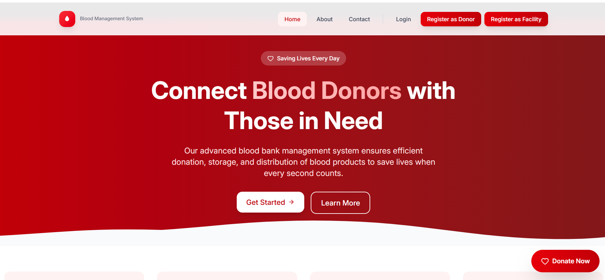
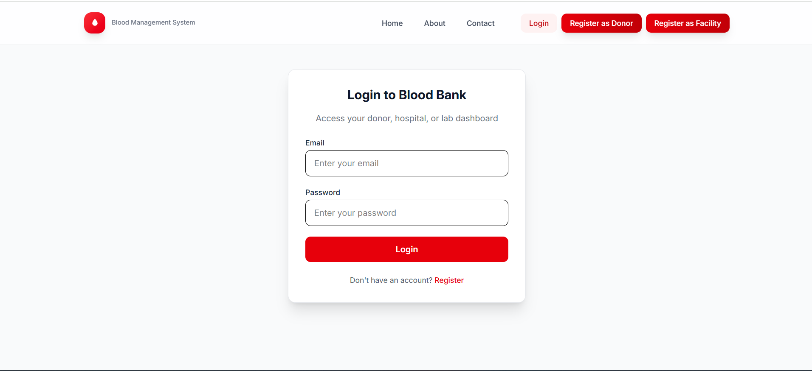
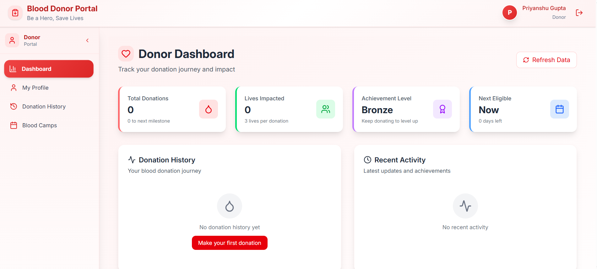

# Blood Bank Management System (BBMS)

A full-stack web application built with the **MERN stack** (MongoDB, Express.js, React, Node.js) for managing blood donations, inventory, hospital requests, and donor information.


---

## 📋 Table of Contents

- [Overview](#overview)
- [Features](#features)
- [System Architecture](#system-architecture)
- [Tech Stack](#tech-stack)
- [Project Structure](#project-structure)
- [Getting Started](#getting-started)
- [API Endpoints](#api-endpoints)
- [Screenshots](#screenshots)
- [Contributing](#contributing)
- [License](#license)

---

## Overview

The **Blood Bank Management System (BBMS)** is a web-based platform designed to streamline the management of blood donations, hospital requests, and inventory tracking. By replacing manual processes with a structured digital workflow, BBMS enables hospitals and blood banks to access real-time inventory, maintain donor records, and process blood requests efficiently.

---

## The Problem

Many blood banks still rely on manual documentation, scattered information, and slow communication methods. This leads to:

- ❌ No real-time visibility of blood availability
- ❌ Delays during emergency blood requirements
- ❌ Frequent data entry errors
- ❌ Difficulty managing donors, patients, and hospital requests
- ❌ Lack of a centralized system connecting all operations

These limitations reduce the efficiency and reliability of blood bank operations.

---

## Our Solution

BBMS provides an **all-in-one, centralized, and secure system** that handles all operations digitally. Key features include:

- ✅ Donor registration and management
- ✅ Hospital request creation and status tracking
- ✅ Real-time inventory monitoring
- ✅ Secure authentication using JWT
- ✅ Fully structured backend APIs
- ✅ Organized frontend interface for hospitals and staff

The goal is to ensure quick response times, reduce manual errors, and improve operational workflow.

---

## Features

### 🔐 Authentication & Authorization
- User registration and login with JWT tokens
- Role-based access control (Admin, Donor, Hospital, User)
- Protected routes and password recovery

### 👥 User Management
- **Admin Dashboard** - Full system control and monitoring
- **Donor Portal** - Registration, eligibility check, donation history
- **Hospital Access** - Blood request submission and tracking
- **User Profile** - Manage personal information and donation records

### 🩸 Blood Inventory
- Real-time blood stock management
- Blood group-wise inventory tracking
- Expiry date monitoring
- Low stock alerts

### 🏥 Hospital Requests
- Online blood request submission
- Request status tracking
- Emergency request handling
- Request history and reports

### 📍 Blood Donation Camps
- Camp organization and scheduling
- Donor registration at camps
- Camp-wise donation tracking

---

## System Architecture

```
┌─────────────────────────────────────────────────────────────────────────┐
│                           CLIENT LAYER                                   │
│  ┌─────────────┐  ┌─────────────┐  ┌─────────────┐  ┌─────────────┐    │
│  │   Landing   │  │  Auth Pages │  │  Dashboards │  │   Profile   │    │
│  │    Page     │  │ (Login/     │  │ (Admin/     │  │    Page     │    │
│  │             │  │  Register)  │  │  User/      │  │             │    │
│  └─────────────┘  └─────────────┘  │  Donor/     │  └─────────────┘    │
│                                     │  Hospital)  │                     │
│  ┌─────────────┐  ┌─────────────┐  └─────────────┘  ┌─────────────┐    │
│  │   Blood     │  │   Hospital  │                   │   About &   │    │
│  │    Lab      │  │   Requests  │                   │   Contact   │    │
│  └─────────────┘  └─────────────┘                   └─────────────┘    │
│                                                                          │
│                    React.js + Vite + CSS                                 │
└─────────────────────────────────────────────────────────────────────────┘
                                    │
                                    │ HTTP/REST API
                                    ▼
┌─────────────────────────────────────────────────────────────────────────┐
│                           API LAYER                                      │
│  ┌─────────────────────────────────────────────────────────────────┐   │
│  │                    Express.js Server                             │   │
│  │  ┌──────────┐  ┌──────────┐  ┌──────────┐  ┌──────────┐        │   │
│  │  │   Auth   │  │  Admin   │  │  Donor   │  │ Hospital │        │   │
│  │  │  Routes  │  │  Routes  │  │  Routes  │  │  Routes  │        │   │
│  │  └────┬─────┘  └────┬─────┘  └────┬─────┘  └────┬─────┘        │   │
│  │       │             │             │             │                │   │
│  │  ┌────▼─────┐  ┌────▼─────┐  ┌────▼─────┐  ┌────▼─────┐        │   │
│  │  │   Auth   │  │  Admin   │  │  Donor   │  │ Hospital │        │   │
│  │  │Controller│  │Controller│  │Controller│  │Controller│        │   │
│  │  └──────────┘  └──────────┘  └──────────┘  └──────────┘        │   │
│  │                                                                  │   │
│  │  ┌──────────────────────────────────────────────────────────┐   │   │
│  │  │              Middleware Layer                             │   │   │
│  │  │  • Authentication (JWT)  • Role-based Access Control      │   │   │
│  │  │  • Input Validation      • Error Handling                 │   │   │
│  │  └──────────────────────────────────────────────────────────┘   │   │
│  └─────────────────────────────────────────────────────────────────┘   │
│                                                                          │
│                    Node.js + Express.js                                  │
└─────────────────────────────────────────────────────────────────────────┘
                                    │
                                    │ Mongoose ODM
                                    ▼
┌─────────────────────────────────────────────────────────────────────────┐
│                         DATA LAYER                                       │
│  ┌─────────────┐  ┌─────────────┐  ┌─────────────┐  ┌─────────────┐    │
│  │    User     │  │   Admin     │  │   Donor     │  │   Blood     │    │
│  │   Model     │  │   Model     │  │   Model     │  │   Model     │    │
│  └─────────────┘  └─────────────┘  └─────────────┘  └─────────────┘    │
│  ┌─────────────┐  ┌─────────────┐  ┌─────────────┐  ┌─────────────┐    │
│  │  Blood      │  │   Blood     │  │  Facility   │  │    Camp     │    │
│  │  Request    │  │   Camp      │  │   Model     │  │   Model     │    │
│  │  Model      │  │   Model     │  │             │  │             │    │
│  └─────────────┘  └─────────────┘  └─────────────┘  └─────────────┘    │
│                                                                          │
│                    MongoDB (NoSQL Database)                              │
└─────────────────────────────────────────────────────────────────────────┘
```

---

## Tech Stack

### Frontend
| Technology | Purpose |
|------------|---------|
| React.js | UI Framework |
| Vite | Build Tool & Dev Server |
| CSS3 | Styling |
| React Router | Client-side Routing |

### Backend
| Technology | Purpose |
|------------|---------|
| Node.js | Runtime Environment |
| Express.js | Web Framework |
| MongoDB | Database |
| Mongoose | ODM for MongoDB |
| JWT | Authentication |
| bcrypt.js | Password Hashing |

---

## Project Structure

```
blood-bank-management-system/
├── backend/
│   ├── config/           # Database configuration
│   ├── controllers/      # Business logic handlers
│   │   ├── authContoller.js
│   │   ├── adminController.js
│   │   ├── donorController.js
│   │   ├── hospitalController.js
│   │   ├── bloodLabController.js
│   │   └── facilityController.js
│   ├── middleware/       # Auth middleware
│   ├── middlewares/      # Role-based middlewares
│   ├── models/           # Mongoose schemas
│   │   ├── UserModel.js
│   │   ├── adminModel.js
│   │   ├── donorModel.js
│   │   ├── bloodModel.js
│   │   ├── bloodRequestModel.js
│   │   ├── facilityModel.js
│   │   └── bloodCampModel.js
│   ├── routes/           # API route definitions
│   ├── openapi/          # OpenAPI/Swagger documentation
│   ├── .env.example      # Environment variables template
│   ├── server.js         # Express app entry point
│   └── seedAdmin.js      # Admin user seeder
│
├── frontend/
│   ├── public/           # Static assets
│   ├── src/
│   │   ├── components/   # Reusable UI components
│   │   │   ├── layouts/
│   │   │   ├── Header.jsx
│   │   │   ├── Footer.jsx
│   │   │   └── ProtectedRoute.jsx
│   │   ├── pages/        # Page components
│   │   │   ├── auth/     # Login, Register
│   │   │   ├── admin/    # Admin dashboard
│   │   │   ├── user/     # User dashboard
│   │   │   ├── donor/    # Donor portal
│   │   │   ├── hospital/ # Hospital requests
│   │   │   ├── bloodlab/ # Inventory management
│   │   │   ├── Landing.jsx
│   │   │   ├── Profile.jsx
│   │   │   └── ForgotPassword.jsx
│   │   ├── utils/        # Helper functions
│   │   ├── assets/       # Images, icons
│   │   ├── App.jsx       # Main app component
│   │   └── main.jsx      # React entry point
│   ├── package.json
│   └── vite.config.js
│
├── CONTRIBUTING.md       # Contribution guidelines
└── LICENSE               # MIT License
```

---

## Getting Started

### Prerequisites

- Node.js (v14 or higher)
- MongoDB (local or Atlas)
- npm or yarn

### Installation

1. **Clone the repository**
   ```bash
   git clone https://github.com/priyanshugupta15/blood-bank-management-system.git
   cd blood-bank-management-system
   ```

2. **Install Backend Dependencies**
   ```bash
   cd backend
   npm install
   ```

3. **Install Frontend Dependencies**
   ```bash
   cd ../frontend
   npm install
   ```

4. **Configure Environment Variables**
   
   Create a `.env` file in the `backend` folder:
   ```env
   MONGO_URI=mongodb://localhost:27017/bbms
   JWT_SECRET=your_super_secret_jwt_key
   PORT=5000
   ```

5. **Seed Admin User (Optional)**
   ```bash
   cd backend
   node seedAdmin.js
   ```

### Running the Application

**Start Backend:**
```bash
cd backend
npm start
# Server runs on http://localhost:5000
```

**Start Frontend:**
```bash
cd frontend
npm run dev
# App runs on http://localhost:5173
```

---

## API Endpoints

### Authentication
| Method | Endpoint | Description |
|--------|----------|-------------|
| POST | `/api/auth/register` | Register new user |
| POST | `/api/auth/login` | User login |
| POST | `/api/auth/forgot-password` | Request password reset |

### Admin
| Method | Endpoint | Description |
|--------|----------|-------------|
| GET | `/api/admin/dashboard` | Get admin dashboard data |
| GET | `/api/admin/users` | Get all users |
| DELETE | `/api/admin/users/:id` | Delete a user |

### Donor
| Method | Endpoint | Description |
|--------|----------|-------------|
| POST | `/api/donor/register` | Register as donor |
| GET | `/api/donor/profile` | Get donor profile |
| PUT | `/api/donor/profile` | Update donor info |

### Blood Lab
| Method | Endpoint | Description |
|--------|----------|-------------|
| GET | `/api/bloodlab/inventory` | Get blood inventory |
| POST | `/api/bloodlab/add` | Add blood to inventory |
| PUT | `/api/bloodlab/update/:id` | Update blood record |

### Hospital
| Method | Endpoint | Description |
|--------|----------|-------------|
| POST | `/api/hospital/request` | Request blood |
| GET | `/api/hospital/requests` | Get all requests |
| PUT | `/api/hospital/request/:id` | Update request status |

---

## Screenshots

### Landing Page


### Login Page


### Donor Dashboard


---

## Contributing

Contributions are welcome! Please read [CONTRIBUTING.md](CONTRIBUTING.md) for guidelines on how to contribute to this project.

### Quick Start for Contributors

1. Fork the repository
2. Create a feature branch (`git checkout -b feature/amazing-feature`)
3. Commit your changes (`git commit -m 'Add amazing feature'`)
4. Push to the branch (`git push origin feature/amazing-feature`)
5. Open a Pull Request

---

## License

This project is licensed under the MIT License. See the [LICENSE](LICENSE) file for details.

---

## Acknowledgments

- Built with ❤️ using the MERN Stack
- Special thanks to all contributors
- Inspired by real-world blood bank operations

---

**Happy Coding! 🩸**


